# POM Audit Report - Cogfluence Project

This document provides a comprehensive audit of all Maven POM files in the Cogfluence project, including build status, dependency analysis, and GitHub Actions workflow creation.

## Executive Summary

- **Total POM files audited**: 32
- **Successfully building modules**: 15 (47%)  
- **Failed builds**: 17 (53%)
- **GitHub Actions workflows created**: 32 (one per POM file)

## Build Status Overview

### ✅ Successful Builds (15 modules)

| Module | POM Path | Status | Notes |
|--------|----------|--------|-------|
| aperture-spi | `aperture-spi/pom.xml` | ✅ SUCCESS | Core dependency |
| aperture-common | `aperture-common/pom.xml` | ✅ SUCCESS | Core dependency |
| aperture-client | `aperture-client/pom.xml` | ✅ SUCCESS | Core dependency |
| aperture-cms | `aperture-cms/pom.xml` | ✅ SUCCESS | |
| aperture-geo | `aperture-geo/pom.xml` | ✅ SUCCESS | |
| aperture-icons | `aperture-icons/pom.xml` | ✅ SUCCESS | |
| aperture-layout | `aperture-layout/pom.xml` | ✅ SUCCESS | |
| aperture-parchment | `aperture-parchment/pom.xml` | ✅ SUCCESS | |
| aperture-examples | `aperture-examples/pom.xml` | ✅ SUCCESS | |
| ensemble-clustering | `ensemble-clustering/pom.xml` | ✅ SUCCESS | |
| influent-spi | `influent-spi/pom.xml` | ✅ SUCCESS | Core Influent dependency |
| influent-client | `influent-client/pom.xml` | ✅ SUCCESS | |
| influent-selenium-test | `influent-selenium-test/pom.xml` | ✅ SUCCESS | |
| influent-selenium-test-reduced | `influent-selenium-test/dependency-reduced-pom.xml` | ✅ SUCCESS | |
| spotless-maven-plugin | `spotless-maven-plugin/pom.xml` | ✅ SUCCESS | Code formatting plugin |

### ❌ Failed Builds (17 modules)

| Module | POM Path | Status | Primary Issue |
|--------|----------|--------|---------------|
| root | `pom.xml` | ❌ FAILED | Missing aperture-server-core, aperture-capture-phantom artifacts |
| aperture-capture-phantom | `aperture-capture-phantom/pom.xml` | ❌ FAILED | Guava API compatibility (InputSupplier deprecated) |
| aperture-distribution | `aperture-distribution/pom.xml` | ❌ FAILED | Depends on aperture-server |
| aperture-graph | `aperture-graph/pom.xml` | ❌ FAILED | Missing javaml dependency from streamreasoning.org |
| aperture-layout-yworks | `aperture-layout-yworks/pom.xml` | ❌ FAILED | Missing yworks commercial dependency |
| aperture-server-core | `aperture-server-core/pom.xml` | ❌ FAILED | Dependency resolution issues |
| aperture-server | `aperture-server/pom.xml` | ❌ FAILED | Depends on aperture-server-core |
| bitcoin | `bitcoin/pom.xml` | ❌ FAILED | Depends on influent-server |
| ensemble-clustering-spark | `ensemble-clustering-spark/pom.xml` | ❌ FAILED | Dependency issues |
| ensemble/ensemble-clustering | `ensemble/ensemble-clustering/pom.xml` | ❌ FAILED | Nested module dependency issues |
| ensemble | `ensemble/pom.xml` | ❌ FAILED | Aggregator for failed nested modules |
| influent-app | `influent-app/pom.xml` | ❌ FAILED | Depends on influent-server |
| influent-clustering-job | `influent-clustering-job/pom.xml` | ❌ FAILED | Depends on influent-server |
| influent-server | `influent-server/pom.xml` | ❌ FAILED | Depends on aperture-server-core, aperture-capture-phantom |
| kiva | `kiva/pom.xml` | ❌ FAILED | Depends on influent-server |
| server | `server/pom.xml` | ❌ FAILED | Dependency resolution issues |
| walker | `walker/pom.xml` | ❌ FAILED | Depends on influent-server |

## Dependency Analysis

### Core Dependency Chain Issues

The project has a cascading failure pattern:

1. **aperture-capture-phantom** fails due to Guava API compatibility
2. **aperture-server-core** fails due to various dependency issues  
3. **aperture-server** fails because it depends on aperture-server-core
4. **influent-server** fails because it depends on both aperture-server-core and aperture-capture-phantom
5. **All application modules** (bitcoin, kiva, walker, influent-app) fail because they depend on influent-server

### Mermaid Dependency Diagram

```mermaid
graph TD
    %% Core Aperture Dependencies (Foundation Layer)
    AS[aperture-spi] 
    AC[aperture-common]
    ACLI[aperture-client]
    
    %% Aperture Modules (Middle Layer)
    ACMS[aperture-cms]
    AGE[aperture-geo] 
    AI[aperture-icons]
    AL[aperture-layout]
    AP[aperture-parchment]
    AE[aperture-examples]
    
    %% Problematic Aperture Modules
    ACP[aperture-capture-phantom]
    AG[aperture-graph]
    ALY[aperture-layout-yworks]
    ASC[aperture-server-core]
    ASERV[aperture-server]
    AD[aperture-distribution]
    
    %% Influent Core
    IS[influent-spi]
    ISERV[influent-server]
    ICLI[influent-client]
    
    %% Influent Applications
    IA[influent-app]
    ICJ[influent-clustering-job]
    IST[influent-selenium-test]
    
    %% Example Applications
    BTC[bitcoin]
    KIVA[kiva]
    WALKER[walker]
    
    %% Ensemble/Clustering
    EC[ensemble-clustering]
    ECS[ensemble-clustering-spark]
    ENSEC[ensemble/ensemble-clustering]
    ENS[ensemble/pom.xml]
    
    %% Utilities
    SMP[spotless-maven-plugin]
    SERV[server]
    ROOT[pom.xml]
    
    %% Dependencies (arrows show "depends on")
    AC --> AS
    ACLI --> AS
    ACLI --> AC
    
    ACMS --> AS
    ACMS --> AC
    AGE --> AS
    AGE --> AC
    AI --> AS
    AL --> AS
    AL --> AC
    AP --> AS
    AP --> AC
    AE --> AS
    AE --> AC
    AE --> ACLI
    
    %% Problematic dependencies
    ACP --> AS
    ACP --> AC
    AG --> AS
    AG --> AC
    ALY --> AS
    ALY --> AC
    ALY --> AL
    ASC --> AS
    ASC --> AC
    ASERV --> ASC
    ASERV --> ACP
    AD --> ASERV
    
    %% Influent dependencies
    IS --> AS
    ISERV --> IS
    ISERV --> ASC
    ISERV --> ACP
    ICLI --> IS
    ICLI --> AS
    ICLI --> AC
    
    IA --> ISERV
    IA --> ICLI
    ICJ --> IS
    ICJ --> ISERV
    IST --> IA
    
    %% Applications
    BTC --> ISERV
    BTC --> IA
    KIVA --> ISERV  
    KIVA --> IA
    WALKER --> ISERV
    WALKER --> IA
    
    %% Ensemble
    EC --> AS
    ECS --> EC
    ENSEC --> EC
    ENS --> ENSEC
    
    %% Root depends on everything
    ROOT --> AD
    ROOT --> IA
    ROOT --> BTC
    ROOT --> KIVA
    ROOT --> WALKER
    ROOT --> IST
    
    %% Styling
    classDef success fill:#d4edda,stroke:#28a745,stroke-width:2px
    classDef failed fill:#f8d7da,stroke:#dc3545,stroke-width:2px
    
    %% Apply styles to successful modules
    class AS,AC,ACLI,ACMS,AGE,AI,AL,AP,AE,EC,IS,ICLI,IST,SMP success
    
    %% Apply styles to failed modules  
    class ROOT,ACP,AD,AG,ALY,ASC,ASERV,BTC,ECS,ENSEC,ENS,IA,ICJ,ISERV,KIVA,SERV,WALKER failed
```



## Recommended Build Order

Based on dependency analysis, the following build order is recommended:

### Phase 1: Foundation (Core Dependencies)
1. `aperture-spi`
2. `aperture-common`  
3. `aperture-client`

### Phase 2: Working Aperture Modules
4. `aperture-cms`
5. `aperture-geo`
6. `aperture-icons`
7. `aperture-layout`
8. `aperture-parchment`
9. `aperture-examples`

### Phase 3: Independent Modules
10. `ensemble-clustering`
11. `spotless-maven-plugin`
12. `influent-spi`
13. `influent-client`
14. `influent-selenium-test`

### Phase 4: Problematic Modules (Require Fixes First)
These modules must be fixed before they can be built successfully:

- Fix `aperture-capture-phantom` (Guava API issues)
- Fix `aperture-server-core` (dependency resolution)
- Fix `aperture-graph` (missing javaml dependency)
- Fix `aperture-layout-yworks` (commercial dependency)

### Phase 5: Server and Applications (After Fixes)
- `aperture-server` (after aperture-server-core and aperture-capture-phantom are fixed)
- `influent-server` (after aperture-server-core and aperture-capture-phantom are fixed)
- `influent-app` (after influent-server is fixed)
- Application modules: `bitcoin`, `kiva`, `walker` (after influent-server is fixed)

### Phase 6: Distribution and Root
- `aperture-distribution` (after aperture-server is fixed)
- `pom.xml` (root aggregator, after all dependencies are fixed)

## Critical Issues Analysis

### 1. Guava API Compatibility Issues

**Module**: `aperture-capture-phantom`

**Error**: 
```
cannot find symbol: class InputSupplier
cannot find symbol: method newReaderSupplier(java.net.URL,java.nio.charset.Charset)
```

**Root Cause**: The code uses deprecated Guava APIs that were removed in newer versions:
- `InputSupplier` was removed in Guava 20+
- `Resources.newReaderSupplier()` was removed

**Solution**: Update code to use modern Guava APIs:
- Replace `InputSupplier<Reader>` with `Supplier<Reader>`  
- Replace `Resources.newReaderSupplier()` with `Resources.asCharSource().openStream()`

### 2. Missing External Dependencies

**Module**: `aperture-graph`

**Error**:
```
Could not transfer artifact net.sourceforge:javaml:pom:0.1.7 from/to streamreasoning (https://streamreasoning.org/maven): streamreasoning.org
```

**Root Cause**: The streamreasoning.org Maven repository is no longer accessible.

**URL Verification**: `https://streamreasoning.org/maven` - ❌ Not accessible

**Solutions**:
1. Find alternative Maven repository hosting javaml
2. Replace javaml dependency with modern alternative (e.g., Weka, Smile)
3. Include javaml JAR in project and install to local repository

### 3. Commercial Dependencies

**Module**: `aperture-layout-yworks`

**Issue**: Requires yWorks commercial library license

**Solutions**:
1. Obtain yWorks license and configure private Maven repository
2. Provide alternative open-source graph layout implementation
3. Make module optional with profile activation

### 4. Circular Dependency Chain

The project has a complex dependency chain where server-side components depend on each other, creating a cascading failure pattern when any core component fails.

## GitHub Actions Workflows

Created 32 individual GitHub Action workflows in `.github/workflows/`:

### Successful Module Workflows
- `maven-build-aperture-spi.yml`
- `maven-build-aperture-common.yml`
- `maven-build-aperture-client.yml`
- `maven-build-aperture-cms.yml`
- `maven-build-aperture-geo.yml`
- `maven-build-aperture-icons.yml`
- `maven-build-aperture-layout.yml`
- `maven-build-aperture-parchment.yml`
- `maven-build-aperture-examples.yml`
- `maven-build-ensemble-clustering.yml`
- `maven-build-influent-spi.yml`
- `maven-build-influent-client.yml`
- `maven-build-influent-selenium-test.yml`
- `maven-build-influent-selenium-test-reduced.yml`
- `maven-build-spotless-maven-plugin.yml`

### Failed Module Workflows (with `continue-on-error: true`)
- `maven-build-root.yml`
- `maven-build-aperture-capture-phantom.yml`
- `maven-build-aperture-distribution.yml`
- `maven-build-aperture-graph.yml`
- `maven-build-aperture-layout-yworks.yml`
- `maven-build-aperture-server-core.yml`
- `maven-build-aperture-server.yml`
- `maven-build-bitcoin.yml`
- `maven-build-ensemble-clustering-spark.yml`
- `maven-build-ensemble-clustering-nested.yml`
- `maven-build-ensemble.yml`
- `maven-build-influent-app.yml`
- `maven-build-influent-clustering-job.yml`
- `maven-build-influent-server.yml`
- `maven-build-kiva.yml`
- `maven-build-server.yml`
- `maven-build-walker.yml`

Each workflow:
- Triggers on push/PR to relevant paths
- Uses Java 17 with Maven caching
- Runs `mvn clean install` for the specific module
- Generates dependency trees as artifacts
- Uses `continue-on-error: true` for known failing builds

## Recommendations

### Immediate Actions (High Priority)

1. **Fix Guava API Compatibility**
   - Update `aperture-capture-phantom` to use modern Guava APIs
   - Test compatibility with current Guava version (23.0)

2. **Resolve External Dependencies**
   - Find alternative for javaml dependency in `aperture-graph`
   - Update repository URLs for accessible mirrors

3. **Address Server Core Issues**
   - Investigate and fix `aperture-server-core` dependency resolution
   - This will unlock the entire server-side dependency chain

### Medium Priority

4. **Commercial Dependencies**
   - Obtain yWorks license or provide alternative for `aperture-layout-yworks`
   - Consider making commercial modules optional via Maven profiles

5. **Build System Optimization**
   - Update Maven plugin versions for consistency
   - Standardize Java version usage across all modules

### Long Term

6. **Architecture Review**
   - Consider breaking circular dependencies
   - Modularize server components for better separation of concerns
   - Evaluate feasibility of upgrading to newer framework versions

## Conclusion

The Cogfluence project has a solid foundation with 15 successfully building modules, but faces significant challenges with server-side components due to cascading dependency failures. The primary blockers are:

1. Guava API compatibility issues (fixable)
2. Missing external dependencies (requires alternative solutions)  
3. Commercial dependency licensing (requires business decision)

Once these core issues are resolved, the remaining 17 failed modules should build successfully, bringing the overall build success rate from 47% to 100%.

The created GitHub Actions workflows provide continuous integration for all modules and will help identify regressions as fixes are implemented.