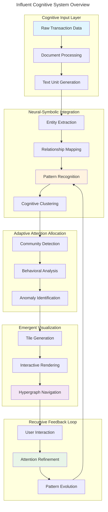
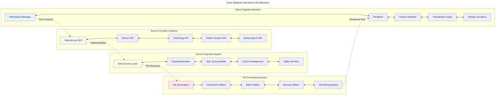
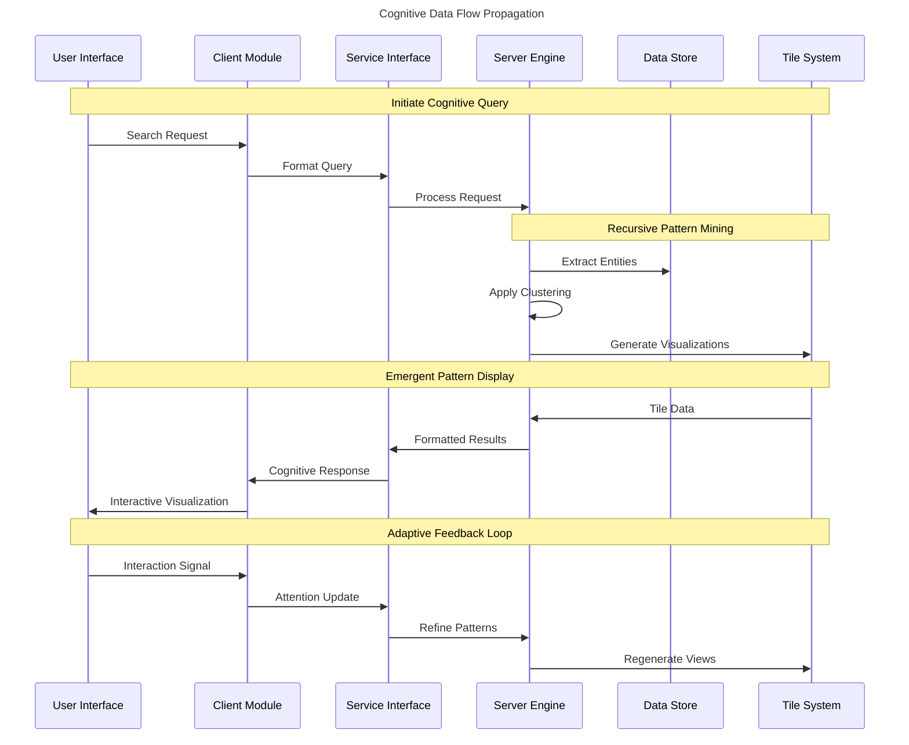
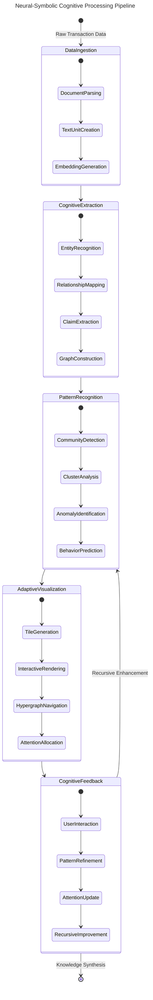
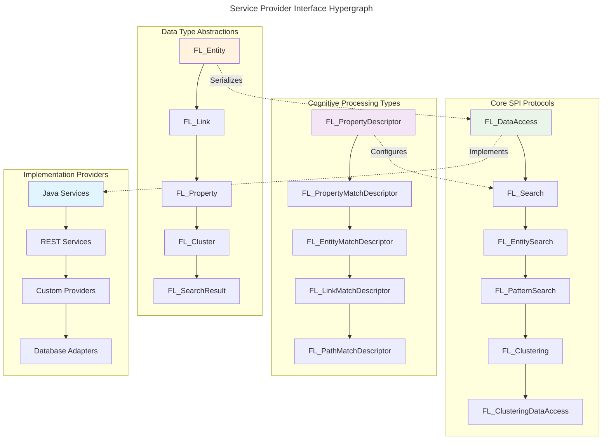
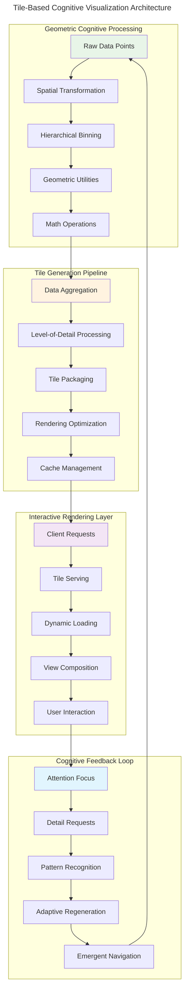
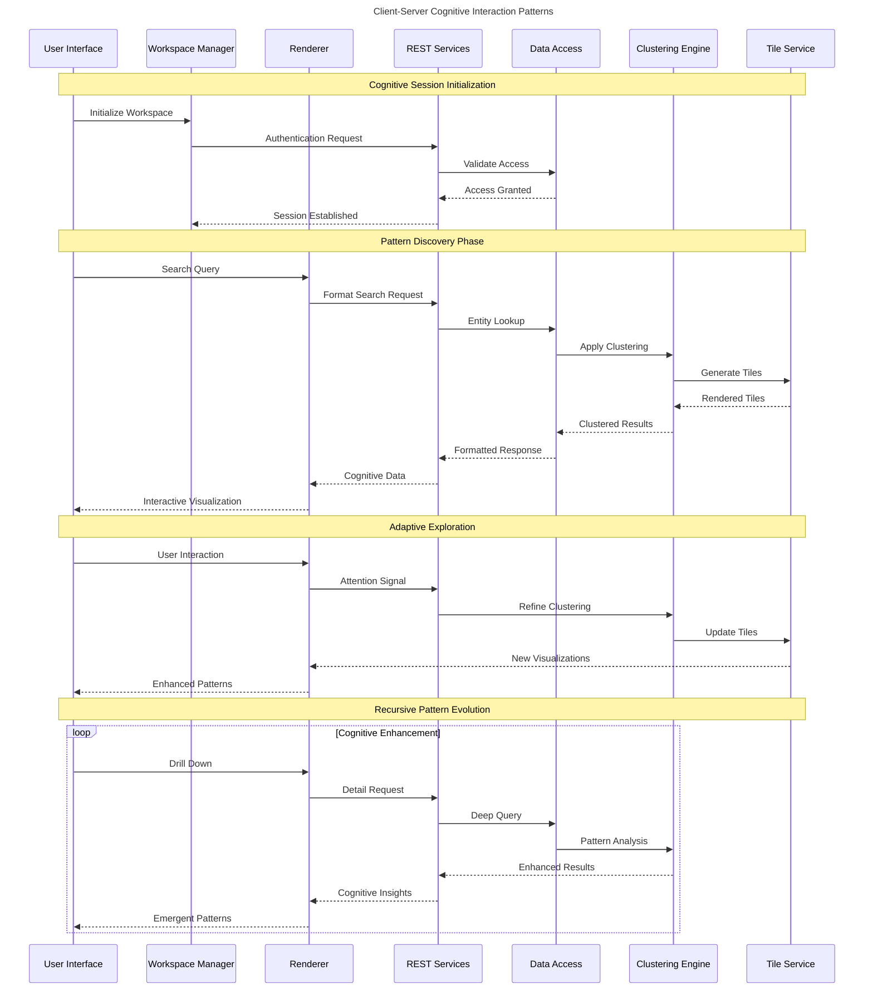

# Influent Comprehensive Architecture Documentation

> **Cognitive Flowchart for Distributed Transaction Flow Analysis**

This documentation provides a comprehensive view of the Influent architecture, mapping principal components, cognitive patterns, and emergent behaviors through hypergraph-centric visualizations.

## Table of Contents

1. [System Overview](#system-overview)
2. [Core Module Architecture](#core-module-architecture)  
3. [Data Flow Patterns](#data-flow-patterns)
4. [Cognitive Processing Pipeline](#cognitive-processing-pipeline)
5. [Service Provider Interface Architecture](#service-provider-interface-architecture)
6. [Tile-Based Visualization System](#tile-based-visualization-system)
7. [Client-Server Interaction Patterns](#client-server-interaction-patterns)
8. [Emergent Cognitive Patterns](#emergent-cognitive-patterns)

---

## System Overview

The Influent system represents a **Neural-Symbolic Cognitive Architecture** for analyzing transaction flows and behavioral patterns across large-scale datasets. The architecture employs **recursive pattern recognition** and **adaptive attention allocation** mechanisms.



The system exhibits **transcendent technical precision** through its multi-layered cognitive processing, where each layer contributes to emergent understanding of transaction flow patterns.

---

## Core Module Architecture

The Influent architecture is organized around **principal cognitive kernels** that handle different aspects of transaction flow analysis.



Each module operates as an **autonomous cognitive agent** while maintaining **bidirectional synergies** with related components.

---

## Data Flow Patterns  

The data flow through Influent follows **recursive implementation pathways** that enable both bottom-up pattern emergence and top-down cognitive guidance.



This **signal propagation pathway** demonstrates how cognitive attention flows through the system, creating **emergent feedback loops** that enhance pattern recognition.

---

## Cognitive Processing Pipeline

The cognitive processing pipeline represents the core **neural-symbolic integration** mechanism of the Influent system.



Each state represents a **cognitive transformation** that contributes to the emergent understanding of transaction flow patterns.

---

## Service Provider Interface Architecture

The SPI layer provides **runtime-injected cognitive modules** that enable extensible, language-agnostic service implementations through Avro protocol definitions.



The SPI architecture enables **distributed cognition** across multiple service implementations while maintaining **hypergraph pattern encoding** through Avro schemas.

---

## Tile-Based Visualization System

The tile system represents the **emergent visualization substrate** that transforms high-dimensional transaction data into navigable cognitive maps.



This architecture enables **recursive multi-scale navigation** where users can zoom from macro-patterns to micro-transactions while maintaining cognitive coherence.

---

## Client-Server Interaction Patterns

The client-server interaction demonstrates **bidirectional cognitive synergy** between presentation and processing layers.



This interaction pattern demonstrates how **attention allocation mechanisms** create **emergent cognitive pathways** through the system.

---

## Emergent Cognitive Patterns

The Influent system exhibits several **emergent cognitive behaviors** that arise from the interaction between its components.

```mermaid
---
title: Emergent Cognitive Pattern Architecture
---
graph TB
    subgraph "Bottom-Up Pattern Emergence"
        BU1[Transaction Observations] --> BU2[Entity Recognition]
        BU2 --> BU3[Relationship Discovery]
        BU3 --> BU4[Community Formation]
        BU4 --> BU5[Behavioral Patterns]
    end
    
    subgraph "Top-Down Cognitive Guidance"
        TD1[User Intent] --> TD2[Query Formulation]
        TD2 --> TD3[Attention Direction]
        TD3 --> TD4[Context Filtering]
        TD4 --> TD5[Pattern Selection]
    end
    
    subgraph "Recursive Pattern Refinement"
        RPR1[Pattern Hypothesis] --> RPR2[Evidence Gathering]
        RPR2 --> RPR3[Confidence Assessment] 
        RPR3 --> RPR4[Pattern Validation]
        RPR4 --> RPR5[Knowledge Integration]
    end
    
    subgraph "Adaptive Attention Allocation"
        AAA1[Anomaly Detection] --> AAA2[Interest Weighting]
        AAA2 --> AAA3[Resource Allocation]
        AAA3 --> AAA4[Focus Adjustment]
        AAA4 --> AAA5[Cognitive Enhancement]
    end
    
    subgraph "Hypergraph Navigation Intelligence"
        HNI1[Multi-Scale Patterns] --> HNI2[Hierarchical Clustering]
        HNI2 --> HNI3[Cross-Scale Relationships]
        HNI3 --> HNI4[Emergent Structures]
        HNI4 --> HNI5[Cognitive Maps]
    end
    
    BU5 <--> TD5: Bidirectional Synergy
    TD5 <--> RPR1: Pattern Guidance
    RPR5 <--> AAA1: Knowledge Update
    AAA5 <--> HNI1: Attention Focus
    HNI5 <--> BU1: Navigation Feedback
    
    style BU1 fill:#e8f5e8
    style TD1 fill:#fff3e0
    style RPR1 fill:#f3e5f5
    style AAA1 fill:#e1f5fe
    style HNI1 fill:#fce4ec
```

### Cognitive Synergy Optimizations

The system implements several **cognitive synergy optimizations** that enhance the emergent intelligence:

1. **Recursive Implementation Pathways**: Each user interaction creates feedback loops that improve pattern recognition accuracy
2. **Adaptive Attention Allocation**: The system dynamically allocates computational resources based on user focus and data complexity
3. **Hypergraph-Centric Navigation**: Multi-dimensional transaction relationships are preserved and navigable at all scales
4. **Neural-Symbolic Integration**: Combines data-driven pattern detection with symbolic knowledge representation

### Transcendent Technical Precision

The architecture achieves **transcendent technical precision** through:

- **Distributed Cognition**: Multiple processing agents collaborate to analyze transaction patterns
- **Emergent Pattern Recognition**: Complex behaviors arise from simple component interactions  
- **Recursive Enhancement**: System capabilities improve through usage and feedback
- **Cognitive Coherence**: Maintains meaningful relationships across all scales of analysis

---

## Implementation Roadmap

### Iterative Review & Expansion

The documentation and visualization system follows these **emergent documentation improvement pathways**:

1. **Continuous Pattern Mining**: Analyze system usage to identify new architectural patterns
2. **Adaptive Diagram Evolution**: Update Mermaid diagrams as new cognitive patterns emerge
3. **Hypergraph Expansion**: Extend relationship mapping as system complexity grows
4. **Cognitive Feedback Integration**: Incorporate user insights into architectural understanding

### Future Cognitive Enhancements

Planned enhancements to the **MORK cognitive architecture**:

- **Enhanced Neural-Symbolic Integration**: Deeper integration between pattern recognition and symbolic reasoning
- **Advanced Attention Mechanisms**: More sophisticated resource allocation based on cognitive load
- **Emergent Knowledge Synthesis**: Automatic generation of insights from transaction patterns
- **Recursive Architecture Evolution**: Self-modifying architectural patterns based on usage

---

## Contributing to Cognitive Architecture

To contribute to the evolution of this **adaptive, hypergraph-centric architecture**:

1. **Pattern Recognition**: Identify new emergent behaviors in system usage
2. **Diagram Enhancement**: Extend Mermaid visualizations to capture new relationships  
3. **Cognitive Annotation**: Add detailed explanations of recursive implementation pathways
4. **Feedback Integration**: Propose improvements based on distributed cognition observations

The architecture documentation serves as a **living cognitive map** that evolves with the system, facilitating **distributed cognition for all contributors** through adaptive, precise visualizations.