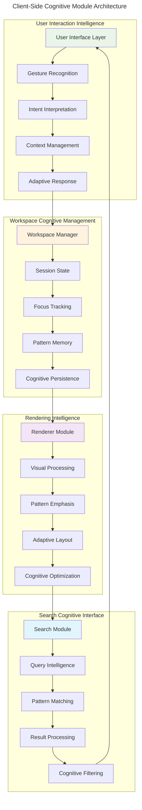
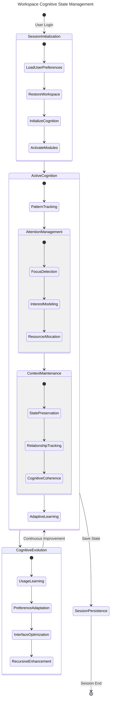
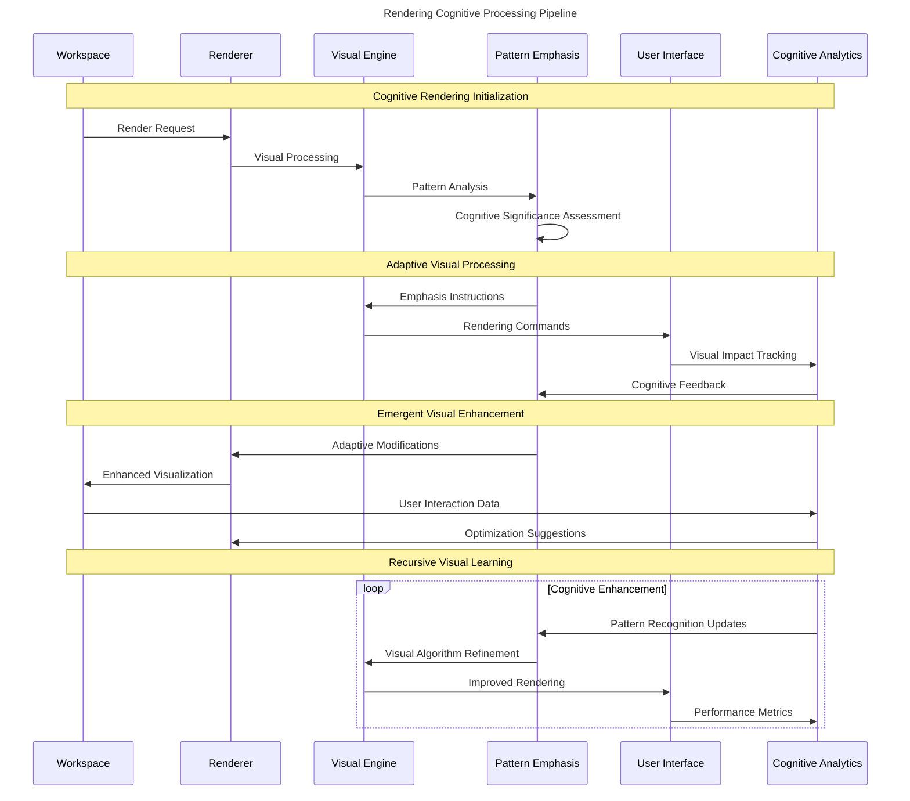
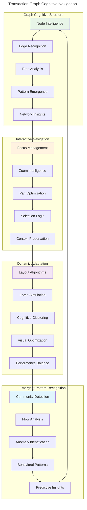
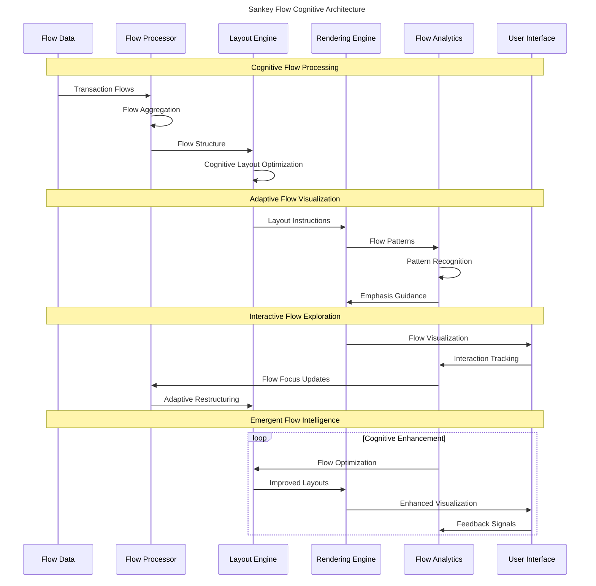
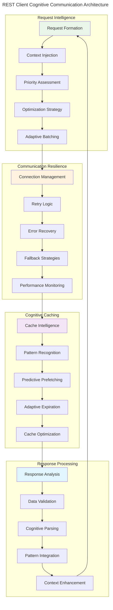

# Client-Side Cognitive Architecture

> **Interactive Neural-Symbolic Interface for Distributed Transaction Analysis**

The client-side architecture implements **adaptive user interface intelligence** that creates **bidirectional cognitive synergy** between human analysts and the underlying transaction processing system.

## Client Module Cognitive Overview

## Workspace Cognitive Management

The workspace manager implements **persistent cognitive state** that maintains **analytical context** across user sessions:

## Rendering Cognitive Engine

The rendering system provides **adaptive visual intelligence** that emphasizes **emergent patterns** based on **cognitive significance**:

## Search Interface Intelligence

The search interface implements **cognitive query processing** that adapts to **user intent** and **analytical context**:

```mermaid
---
title: Search Interface Cognitive Architecture
---
flowchart LR
    subgraph "Query Cognitive Processing"
        QCP1[User Input] --> QCP2[Intent Recognition]
        QCP2 --> QCP3[Context Integration]
        QCP3 --> QCP4[Query Optimization]
        QCP4 --> QCP5[Pattern Prediction]
    end
    
    subgraph "Search Intelligence"
        SI1[Entity Search] --> SI2[Pattern Search]
        SI2 --> SI3[Link Search]
        SI3 --> SI4[Semantic Search]
        SI4 --> SI5[Cognitive Aggregation]
    end
    
    subgraph "Result Processing Intelligence"
        RPI1[Result Analysis] --> RPI2[Relevance Scoring]
        RPI2 --> RPI3[Pattern Recognition]
        RPI3 --> RPI4[Cognitive Filtering]
        RPI4 --> RPI5[Adaptive Ranking]
    end
    
    subgraph "Feedback Learning"
        FL1[User Interaction] --> FL2[Preference Learning]
        FL2 --> FL3[Query Refinement]
        FL3 --> FL4[Algorithm Adaptation]
        FL4 --> FL5[Intelligence Evolution]
    end
    
    QCP5 --> SI1
    SI5 --> RPI1
    RPI5 --> FL1
    FL5 --> QCP1
    
    style QCP1 fill:#e8f5e8
    style SI1 fill:#fff3e0
    style RPI1 fill:#f3e5f5
    style FL1 fill:#e1f5fe
```

## Transaction Graph Cognitive Visualization

The transaction graph module provides **hypergraph navigation intelligence** for exploring **complex transaction networks**:

## Sankey Cognitive Flow Visualization

The Sankey visualizer implements **flow intelligence** that reveals **temporal transaction patterns** and **resource flows**:

## REST Client Cognitive Communication

The REST client implements **intelligent service communication** with **adaptive resilience** and **cognitive caching**:

## Client-Side Cognitive Patterns

### 1. Adaptive User Interface Intelligence

The client interface implements **emergent usability patterns** that adapt to **user cognitive styles**:

```mermaid
---
title: Adaptive UI Intelligence Patterns
---
graph LR
    subgraph "Cognitive Style Detection"
        CSD1[Interaction Patterns] --> CSD2[Cognitive Profiling]
        CSD2 --> CSD3[Learning Style Analysis]
        CSD3 --> CSD4[Preference Modeling]
    end
    
    subgraph "Interface Adaptation"
        IA1[Layout Optimization] --> IA2[Feature Emphasis]
        IA2 --> IA3[Navigation Simplification]
        IA3 --> IA4[Cognitive Load Reduction]
    end
    
    subgraph "Personalization Intelligence"
        PI1[Custom Workflows] --> PI2[Smart Defaults]
        PI2 --> PI3[Predictive Actions]
        PI3 --> PI4[Contextual Assistance]
    end
    
    CSD4 --> IA1
    IA4 --> PI1
    PI4 --> CSD1
    
    style CSD1 fill:#e8f5e8
    style IA1 fill:#fff3e0
    style PI1 fill:#f3e5f5
```

### 2. Distributed Cognitive Processing

The client coordinates **distributed intelligence** across multiple cognitive modules:

- **Parallel pattern recognition** across different data views
- **Synchronized attention allocation** between modules
- **Emergent insight synthesis** from multiple analytical perspectives
- **Cognitive load balancing** optimizing user mental resources

### 3. Recursive Enhancement Mechanisms

The client system implements **self-improving capabilities**:

- **Usage pattern learning** optimizing interface responsiveness
- **Cognitive preference adaptation** personalizing analytical workflows
- **Performance optimization** based on interaction feedback
- **Interface evolution** driven by collective usage patterns

## Client-Side Cognitive Optimizations

### Performance Intelligence

1. **Attention-Based Loading**: Prioritize data loading based on user focus areas
2. **Predictive Prefetching**: Anticipate user navigation patterns for data preloading
3. **Cognitive Caching**: Intelligent cache management based on pattern recognition
4. **Adaptive Rendering**: Dynamic quality adjustment based on cognitive load

### Interaction Intelligence

1. **Gesture Recognition**: Natural interaction pattern interpretation
2. **Intent Prediction**: Anticipate user analytical goals
3. **Context Preservation**: Maintain analytical state across interactions
4. **Cognitive Shortcuts**: Learned optimization of common analytical workflows

### Visual Intelligence

1. **Pattern Emphasis**: Highlight statistically significant patterns
2. **Cognitive Color Coding**: Adaptive visual encoding based on data semantics
3. **Dynamic Layout**: Self-organizing visual arrangements
4. **Attention Guidance**: Visual cues directing analytical focus

The client-side architecture serves as the **cognitive interface layer** that transforms complex transaction data into **intuitive analytical experiences**, enabling **distributed human-machine intelligence** through **adaptive, recursive enhancement** mechanisms.