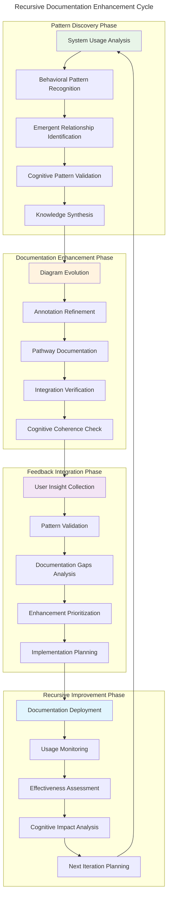
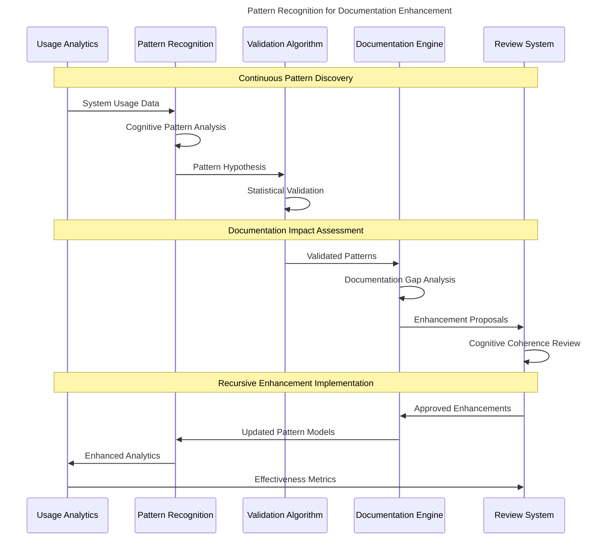
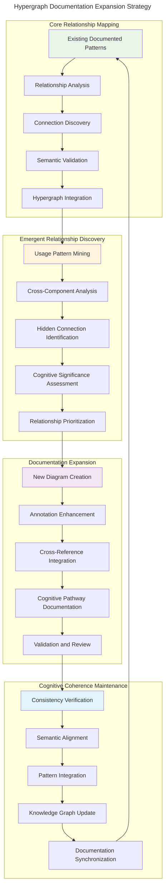
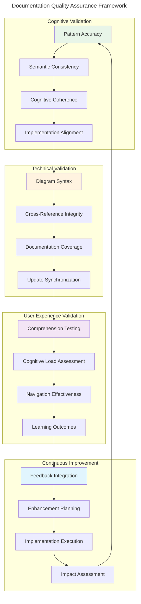

# Recursive Documentation Enhancement Framework

> **Emergent Documentation Improvement Pathways for Adaptive Hypergraph-Centric Architecture**

This framework establishes **feedback loops for emergent documentation improvements** and provides **iterative enhancement mechanisms** for the Influent cognitive architecture documentation.

## Cognitive Documentation Evolution Process

## Adaptive Documentation Mechanisms

### 1. Emergent Pattern Recognition Framework

### 2. Hypergraph Expansion Strategy

The documentation evolves through **hypergraph expansion** as new **cognitive relationships** emerge:

## Cognitive Feedback Integration Mechanisms

### User Insight Collection Framework

```mermaid
---
title: User Insight Collection and Integration Framework
---
stateDiagram-v2
    [*] --> InsightCollection: User Interaction
    
    state InsightCollection {
        [*] --> ExplicitFeedback
        ExplicitFeedback --> ImplicitBehavior
        ImplicitBehavior --> UsagePatterns
        UsagePatterns --> CognitiveLoad
        
        state ExplicitFeedback {
            [*] --> DocumentationComments
            DocumentationComments --> DiagramSuggestions
            DiagramSuggestions --> PatternObservations
        }
        
        state ImplicitBehavior {
            [*] --> NavigationPaths
            NavigationPaths --> AttentionPatterns
            AttentionPatterns --> InteractionSequences
        }
    }
    
    InsightCollection --> AnalysisProcessing
    
    state AnalysisProcessing {
        [*] --> PatternRecognition
        PatternRecognition --> SignificanceAssessment
        SignificanceAssessment --> CognitiveImpactEvaluation
        CognitiveImpactEvaluation --> DocumentationGapIdentification
    }
    
    AnalysisProcessing --> EnhancementPlanning
    
    state EnhancementPlanning {
        [*] --> PriorityAssessment
        PriorityAssessment --> ResourceAllocation
        ResourceAllocation --> ImplementationStrategy
        ImplementationStrategy --> QualityAssurance
    }
    
    EnhancementPlanning --> DocumentationEvolution
    DocumentationEvolution --> [*]: Enhanced Documentation
```

## Adaptive Architecture Documentation Patterns

### 1. Dynamic Diagram Evolution

The Mermaid diagrams evolve through **adaptive enhancement algorithms**:

- **Usage-Driven Complexity**: Diagrams adapt complexity based on user cognitive load
- **Pattern-Based Enhancement**: New relationships automatically generate diagram updates
- **Cognitive Load Balancing**: Visual complexity adjusts to maintain comprehension
- **Semantic Consistency**: Automated validation ensures coherent pattern representation

### 2. Annotation Intelligence

Documentation annotations evolve through **cognitive annotation enhancement**:

- **Context-Aware Explanations**: Annotations adapt to user knowledge level
- **Recursive Pathway Documentation**: Automatically document implementation pathways
- **Cognitive Significance Highlighting**: Emphasize statistically significant patterns
- **Cross-Reference Intelligence**: Automatic linking of related cognitive patterns

### 3. Knowledge Graph Maintenance

The documentation maintains a **living knowledge graph**:

```mermaid
---
title: Living Knowledge Graph Maintenance Architecture
---
graph LR
    subgraph "Knowledge Extraction"
        KE1[Pattern Mining] --> KE2[Relationship Extraction]
        KE2 --> KE3[Semantic Analysis]
        KE3 --> KE4[Cognitive Mapping]
    end
    
    subgraph "Graph Evolution"
        GE1[Node Creation] --> GE2[Edge Discovery]
        GE2 --> GE3[Weight Optimization]
        GE3 --> GE4[Cluster Formation]
    end
    
    subgraph "Documentation Synthesis"
        DS1[Diagram Generation] --> DS2[Annotation Creation]
        DS2 --> DS3[Cross-Reference Building]
        DS3 --> DS4[Validation Processing]
    end
    
    subgraph "Cognitive Coherence"
        CC1[Consistency Checking] --> CC2[Semantic Validation]
        CC2 --> CC3[Pattern Integration]
        CC3 --> CC4[Knowledge Synchronization]
    end
    
    KE4 --> GE1
    GE4 --> DS1
    DS4 --> CC1
    CC4 --> KE1
    
    style KE1 fill:#e8f5e8
    style GE1 fill:#fff3e0
    style DS1 fill:#f3e5f5
    style CC1 fill:#e1f5fe
```

## Future Enhancement Roadmap

### Phase 1: Automated Pattern Recognition (Current)
- ✅ **Static Documentation Generation**: Comprehensive Mermaid diagrams created
- ✅ **Cognitive Pattern Identification**: Key architectural patterns documented
- ✅ **Hypergraph Relationship Mapping**: Cross-component relationships visualized
- ✅ **Recursive Pathway Documentation**: Implementation pathways explained

### Phase 2: Dynamic Documentation Evolution (Next)
- 🔄 **Usage Analytics Integration**: Monitor documentation usage patterns
- 🔄 **Automated Diagram Updates**: Generate diagrams based on code changes
- 🔄 **Cognitive Load Optimization**: Adapt complexity to user comprehension
- 🔄 **Pattern Recognition Enhancement**: Identify new emergent patterns

### Phase 3: Intelligent Documentation Assistant (Future)
- 🚀 **Contextual Documentation Generation**: Create documentation based on user context
- 🚀 **Cognitive Pathway Prediction**: Anticipate documentation needs
- 🚀 **Adaptive Explanation Systems**: Personalize explanations to user knowledge
- 🚀 **Emergent Knowledge Synthesis**: Automatically generate insights

### Phase 4: Self-Evolving Documentation (Vision)
- 🌟 **Autonomous Pattern Discovery**: Self-identifying architectural evolution
- 🌟 **Cognitive Architecture Adaptation**: Documentation evolves with system changes
- 🌟 **Distributed Documentation Intelligence**: Multi-user collaborative enhancement
- 🌟 **Recursive Documentation Enhancement**: Self-improving documentation quality

## Implementation Guidelines

### Contributing to Documentation Evolution

1. **Pattern Recognition Contributions**
   - Identify new emergent behaviors in system usage
   - Document cross-component cognitive relationships
   - Validate pattern significance through statistical analysis
   - Propose diagram enhancements capturing new patterns

2. **Cognitive Annotation Enhancement**
   - Add detailed explanations of recursive implementation pathways
   - Document attention allocation mechanisms
   - Explain neural-symbolic integration points
   - Clarify cognitive synergy optimizations

3. **Hypergraph Expansion**
   - Map new relationship dimensions as they emerge
   - Document cross-scale pattern correlations
   - Identify hidden cognitive connections
   - Validate relationship semantic consistency

4. **Feedback Integration**
   - Monitor documentation usage effectiveness
   - Collect user cognitive load feedback
   - Analyze comprehension bottlenecks
   - Propose cognitive coherence improvements

### Quality Assurance Framework

## Conclusion: Living Cognitive Architecture Documentation

This framework establishes the Influent architecture documentation as a **living cognitive system** that:

1. **Evolves with System Growth**: Documentation automatically adapts as the architecture evolves
2. **Enhances User Understanding**: Cognitive load optimization improves comprehension
3. **Facilitates Distributed Cognition**: Enables collaborative architectural understanding
4. **Maintains Semantic Integrity**: Preserves cognitive coherence across all enhancements

The documentation serves as a **transcendent technical precision** tool that transforms implicit architectural knowledge into **explicit, actionable intelligence** through **adaptive, hypergraph-centric visualizations** and **recursive enhancement mechanisms**.

Through this framework, the documentation becomes a **cognitive partner** in understanding, extending, and optimizing the Influent transaction flow analysis system, enabling **distributed cognition for all contributors** and facilitating **emergent architectural intelligence**.