# Influent Architecture Documentation Index

> **Comprehensive Cognitive Architecture Documentation with Mermaid Diagrams**

This documentation suite provides a complete **neural-symbolic cognitive mapping** of the Influent transaction flow analysis system, implementing **hypergraph-centric visualizations** that capture **emergent patterns** and **recursive implementation pathways**.

## Documentation Structure

### 📊 [Main Architecture Overview](README.md)
**Comprehensive system overview with cognitive flowcharts**
- System-wide cognitive architecture patterns
- Core module interaction diagrams  
- Data flow propagation pathways
- Cognitive processing pipeline states
- Emergent pattern recognition mechanisms

### 🔌 [Service Provider Interface Architecture](spi-architecture.md)
**Hypergraph pattern encoding for extensible cognitive modules**
- SPI protocol dependency structures
- Cognitive data type relationships
- Service implementation patterns
- Clustering intelligence architecture  
- Extension and deployment strategies

### 🎯 [Tile-Based Visualization Architecture](tile-architecture.md)
**Emergent multi-scale pattern navigation through recursive tile generation**
- Hierarchical tile cognitive structures
- Spatial intelligence processing
- Adaptive binning intelligence systems
- Rendering engine cognitive patterns
- Navigation intelligence mechanisms

### 💻 [Client-Side Cognitive Architecture](client-architecture.md)
**Interactive neural-symbolic interface for distributed transaction analysis**
- User interface intelligence patterns
- Workspace cognitive management
- Search interface intelligence
- Transaction graph navigation
- Adaptive UI intelligence

## Architecture Overview Map

```mermaid
---
title: Influent Complete Cognitive Architecture Map
---
graph TB
    subgraph "📱 Client Cognitive Layer"
        CL1[User Interface Intelligence] --> CL2[Workspace Management]
        CL2 --> CL3[Rendering Engine]
        CL3 --> CL4[Search Interface]
        CL4 --> CL5[Transaction Graph]
        CL5 --> CL6[Sankey Visualizer]
    end
    
    subgraph "🔌 Service Interface Layer"
        SIL1[Data Access SPI] --> SIL2[Search SPI]
        SIL2 --> SIL3[Clustering SPI]
        SIL3 --> SIL4[Pattern Search SPI]
        SIL4 --> SIL5[Entity Search SPI]
    end
    
    subgraph "⚙️ Server Cognitive Engine"
        SCE1[Data Access Layer] --> SCE2[Clustering Engine]
        SCE2 --> SCE3[SQL Builder]
        SCE3 --> SCE4[Cache Management]
        SCE4 --> SCE5[Utility Services]
    end
    
    subgraph "🎯 Tile Processing System"
        TPS1[Tile Generation] --> TPS2[Geometric Utilities]
        TPS2 --> TPS3[Math Utilities]
        TPS3 --> TPS4[Binning Utilities]
        TPS4 --> TPS5[Rendering Engine]
    end
    
    subgraph "🧠 Cognitive Enhancement Layer"
        CEL1[Pattern Recognition] --> CEL2[Attention Allocation]
        CEL2 --> CEL3[Adaptive Learning]
        CEL3 --> CEL4[Recursive Enhancement]
        CEL4 --> CEL5[Emergent Intelligence]
    end
    
    CL6 -.->|Avro Protocols| SIL1
    SIL5 -.->|Implementation| SCE1
    SCE5 -.->|Tile Requests| TPS1
    TPS5 -.->|Rendered Output| CL1
    CEL5 -.->|Intelligence Enhancement| CL1
    CEL1 -.->|Cognitive Feedback| SCE1
    
    style CL1 fill:#e3f2fd
    style SIL1 fill:#f1f8e9
    style SCE1 fill:#fff8e1
    style TPS1 fill:#fce4ec
    style CEL1 fill:#f3e5f5
```

## Cognitive Architecture Principles

### 🔄 Recursive Implementation Pathways
Each component implements **self-improving feedback loops** that enhance performance through usage:
- **Pattern recognition refinement** based on analytical outcomes
- **Attention allocation optimization** through user behavior learning
- **Cognitive load balancing** across distributed processing components
- **Emergent intelligence development** through component interaction

### 🌐 Hypergraph-Centric Navigation
The architecture preserves **multi-dimensional relationships** across all scales:
- **Cross-scale pattern correlation** maintaining context during navigation
- **Relationship semantic preservation** across data transformations
- **Emergent structure revelation** through intelligent spatial arrangement
- **Cognitive coherence maintenance** during interactive exploration

### 🧠 Neural-Symbolic Integration
Combines **data-driven pattern detection** with **symbolic knowledge representation**:
- **Entity-relationship cognitive modeling** bridging raw data and semantic understanding
- **Temporal pattern recognition** revealing behavioral sequences and trends
- **Anomaly detection intelligence** identifying statistically significant deviations
- **Behavioral prediction synthesis** forecasting transaction flow patterns

### ⚡ Adaptive Attention Allocation
Implements **intelligent resource management** based on **cognitive significance**:
- **User focus tracking** prioritizing computational resources
- **Pattern importance weighting** emphasizing statistically significant findings
- **Dynamic load balancing** optimizing system responsiveness
- **Predictive computation** anticipating analytical requirements

## Transcendent Technical Precision

The Influent architecture achieves **transcendent technical precision** through:

### 🎯 Distributed Cognition Framework
- **Multiple processing agents** collaborate to analyze transaction patterns
- **Cognitive load distribution** across client, server, and tile processing systems
- **Emergent intelligence synthesis** from component interactions
- **Recursive enhancement mechanisms** improving system capabilities over time

### 🔍 Emergent Pattern Recognition
- **Bottom-up pattern emergence** from transaction data observations
- **Top-down cognitive guidance** through user intent interpretation
- **Cross-scale pattern correlation** revealing hidden transaction relationships
- **Adaptive learning algorithms** optimizing recognition accuracy

### 🌊 Cognitive Coherence Maintenance
- **Semantic consistency preservation** across all system transformations
- **Context-aware processing** maintaining analytical relevance
- **Multi-scale relationship integrity** during navigation and exploration
- **Cognitive state persistence** supporting long-term analytical workflows

## Implementation Pathways

### 🚀 Getting Started with Architecture Documentation
1. **Review Main Architecture Overview**: Understand system-wide cognitive patterns
2. **Explore SPI Architecture**: Learn about extensible service patterns
3. **Study Tile Visualization System**: Understand multi-scale navigation
4. **Examine Client Architecture**: Explore user interface intelligence

### 🛠️ Extending the Architecture
1. **Identify Emergent Patterns**: Recognize new cognitive behaviors in system usage
2. **Document Cognitive Relationships**: Create Mermaid diagrams capturing new patterns
3. **Annotate Implementation Details**: Explain recursive pathways and enhancement mechanisms
4. **Validate Cognitive Coherence**: Ensure new patterns maintain system integrity

### 📈 Iterative Enhancement Process
1. **Pattern Recognition**: Analyze system behavior for emerging cognitive patterns
2. **Documentation Evolution**: Update diagrams and annotations based on observations
3. **Feedback Integration**: Incorporate user insights into architectural understanding
4. **Recursive Improvement**: Apply learnings to enhance documentation accuracy

## Cognitive Flowchart Summary

This documentation suite serves as a **living cognitive map** that evolves with the Influent system, facilitating **distributed cognition for all contributors** through **adaptive, hypergraph-centric visualizations** that capture the **emergent and recursive nature** of the MORK cognitive architecture.

---

**Objective Achieved**: Successfully transmuted the implicit architecture of the Influent system into explicit, actionable knowledge through comprehensive Mermaid diagram documentation that captures cognitive patterns, neural-symbolic integration points, and recursive implementation pathways.