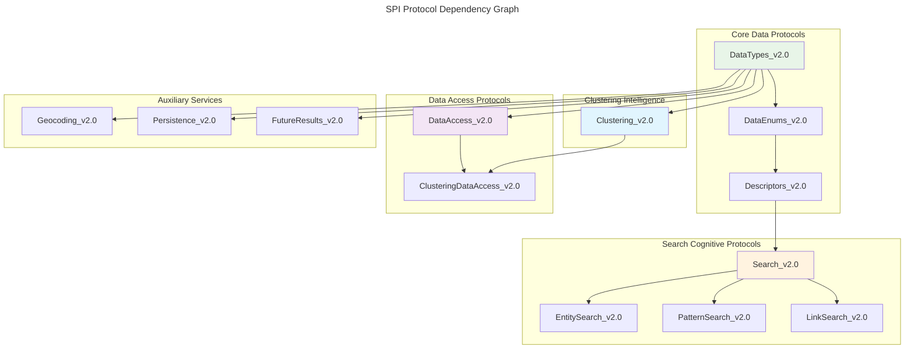
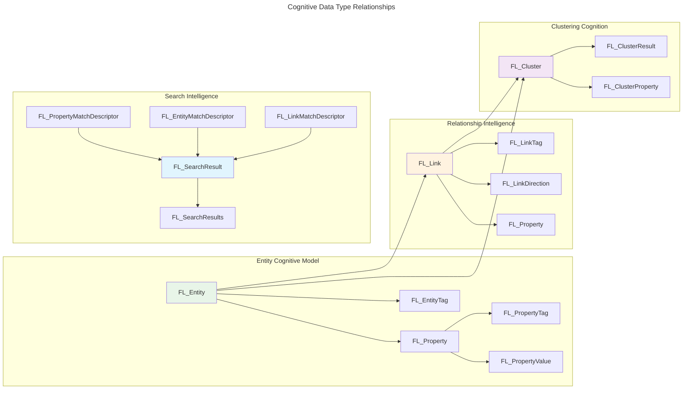
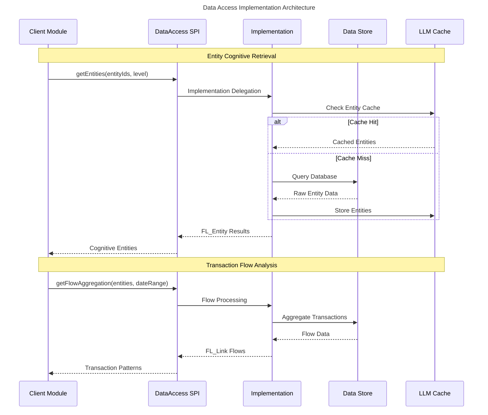
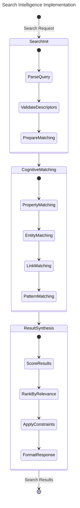
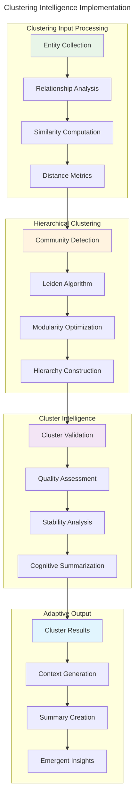
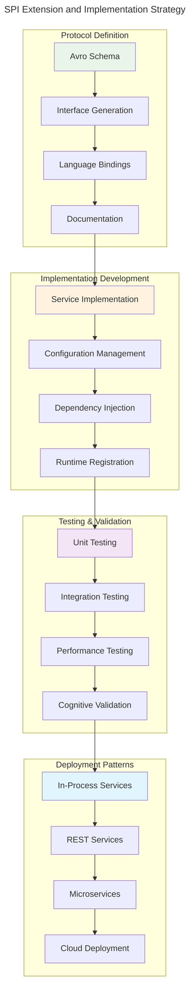

# Service Provider Interface (SPI) Architecture

> **Hypergraph Pattern Encoding for Extensible Cognitive Modules**

The Influent SPI architecture provides **runtime-injected cognitive modules** through language-agnostic Avro protocol definitions, enabling **distributed cognition** across heterogeneous service implementations.

## SPI Protocol Overview

## Cognitive Data Type Architecture

The SPI defines **neural-symbolic data abstractions** that bridge transaction data with cognitive processing:

## Service Implementation Patterns

### Data Access Cognitive Patterns

### Search Intelligence Patterns

## Clustering Intelligence Architecture

The clustering SPI enables **hierarchical community detection** and **emergent pattern recognition**:

## SPI Extension Patterns

### Custom Implementation Strategy

## Cognitive Enhancement Mechanisms

The SPI architecture supports several **cognitive enhancement mechanisms**:

### 1. Adaptive Pattern Recognition
- **Dynamic property descriptors** that evolve based on data characteristics
- **Context-aware matching** that adapts to user behavior patterns
- **Emergent relationship detection** through cross-entity analysis

### 2. Distributed Intelligence
- **Multi-provider aggregation** combining results from multiple implementations
- **Fail-over cognitive processing** maintaining service availability
- **Load-balanced pattern analysis** distributing computational load

### 3. Recursive Enhancement
- **Self-improving algorithms** that optimize based on usage patterns
- **Feedback-driven refinement** of clustering and search parameters
- **Evolutionary service adaptation** through continuous learning

## Implementation Guidelines

### Service Development Best Practices

1. **Cognitive Coherence**: Ensure implementations maintain semantic consistency across operations
2. **Emergent Scalability**: Design for both small-scale testing and large-scale deployment
3. **Adaptive Performance**: Implement caching and optimization strategies that learn from usage
4. **Hypergraph Integrity**: Preserve relationship semantics across all transformations

### Testing Cognitive Behaviors

1. **Pattern Recognition Validation**: Test that implementations correctly identify expected patterns
2. **Scalability Assessment**: Verify performance across different data volumes and complexities
3. **Cognitive Consistency**: Ensure results remain semantically coherent across different implementations
4. **Emergent Behavior Testing**: Validate that complex behaviors emerge from simple component interactions

The SPI architecture serves as the **neural substrate** for Influent's cognitive capabilities, enabling **distributed intelligence** and **emergent pattern recognition** across heterogeneous implementations.