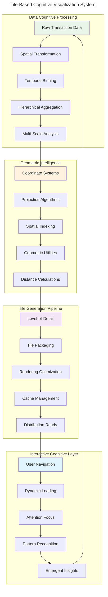
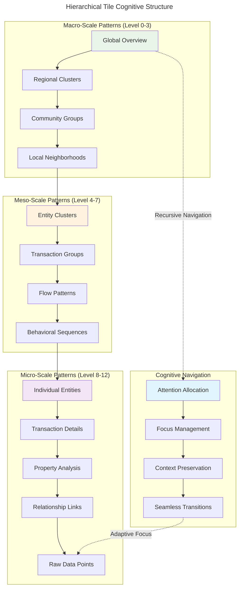
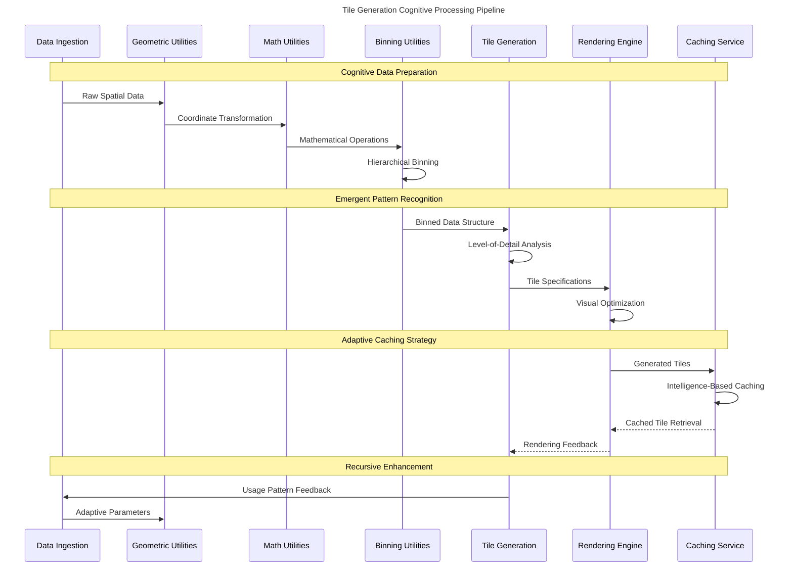
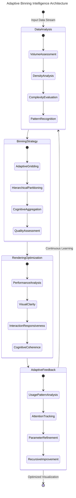
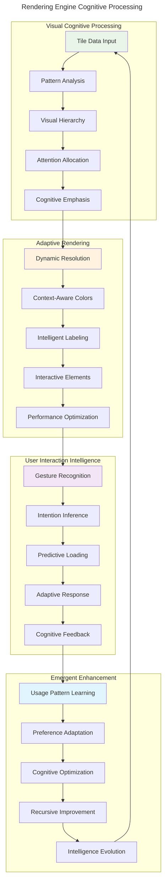
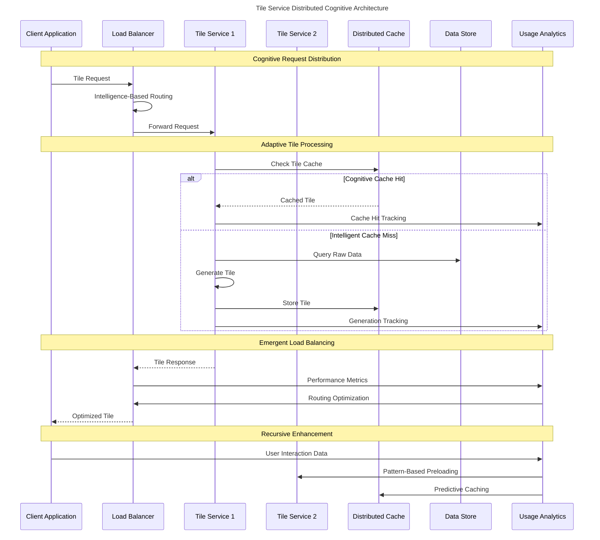
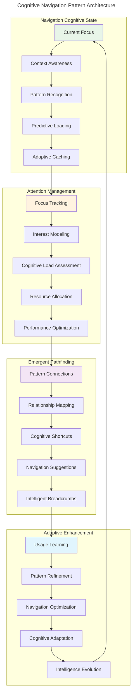

# Tile-Based Visualization Cognitive Architecture

> **Emergent Multi-Scale Pattern Navigation Through Recursive Tile Generation**

The tile-based visualization system represents the **emergent visualization substrate** that transforms high-dimensional transaction data into **navigable cognitive maps** with **adaptive attention allocation** mechanisms.

## Tile System Overview

## Hierarchical Tile Architecture

The tile system implements **recursive multi-scale representation** enabling **cognitive coherence** across all levels of detail:

## Tile Generation Cognitive Pipeline

The tile generation follows **emergent pattern recognition** principles with **adaptive granularity**:

## Spatial Intelligence Architecture

The geometric processing system implements **hypergraph spatial reasoning** for transaction flow visualization:

```mermaid
---
title: Spatial Intelligence Processing Architecture
---
flowchart LR
    subgraph "Coordinate Cognitive Processing"
        CCP1[Geographic Coordinates] --> CCP2[Projection Transformation]
        CCP2 --> CCP3[Spatial Normalization]
        CCP3 --> CCP4[Hierarchical Indexing]
    end
    
    subgraph "Geometric Relationship Analysis"
        GRA1[Entity Positioning] --> GRA2[Distance Calculations]
        GRA2 --> GRA3[Proximity Analysis]
        GRA3 --> GRA4[Spatial Clustering]
    end
    
    subgraph "Temporal-Spatial Integration"
        TSI1[Time Series Mapping] --> TSI2[Spatiotemporal Correlation]
        TSI2 --> TSI3[Flow Direction Analysis]
        TSI3 --> TSI4[Pattern Evolution Tracking]
    end
    
    subgraph "Adaptive Visualization"
        AV1[Dynamic Scaling] --> AV2[Cognitive Filtering]
        AV2 --> AV3[Attention-Based Rendering]
        AV3 --> AV4[Interactive Response]
    end
    
    CCP4 --> GRA1
    GRA4 --> TSI1
    TSI4 --> AV1
    AV4 --> CCP1
    
    style CCP1 fill:#e8f5e8
    style GRA1 fill:#fff3e0
    style TSI1 fill:#f3e5f5
    style AV1 fill:#e1f5fe
```

## Binning Intelligence System

The binning system provides **adaptive granularity control** that responds to **cognitive load** and **attention allocation**:

## Rendering Engine Cognitive Architecture

The rendering engine implements **emergent visual intelligence** that adapts to user **cognitive patterns**:

## Tile Service Cognitive Distribution

The tile service implements **distributed cognitive processing** for scalable pattern visualization:

## Cognitive Navigation Patterns

The tile system enables **hypergraph navigation intelligence** through **recursive pattern recognition**:

## Tile System Cognitive Optimizations

### 1. Adaptive Pattern Recognition
- **Multi-scale pattern consistency** across all tile levels
- **Emergent pattern emphasis** based on statistical significance
- **Cognitive coherence preservation** during navigation transitions

### 2. Intelligent Resource Management
- **Attention-based resource allocation** prioritizing user focus areas
- **Predictive computation** for likely navigation paths
- **Distributed processing** balancing cognitive load across services

### 3. Recursive Enhancement Mechanisms
- **Usage pattern learning** improving tile generation strategies
- **Performance feedback loops** optimizing rendering algorithms
- **Cognitive adaptation** personalizing visualization approaches

### 4. Hypergraph Spatial Intelligence
- **Multi-dimensional relationship preservation** in 2D visualizations
- **Cross-scale pattern correlation** maintaining context across levels
- **Emergent spatial arrangement** revealing hidden transaction patterns

The tile-based visualization system serves as the **emergent cognitive interface** between high-dimensional transaction data and **human pattern recognition capabilities**, enabling **transcendent navigation** through complex financial networks with **adaptive intelligence** and **recursive enhancement**.